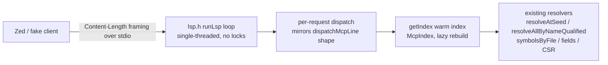

# LSP server — Phase 1 PoC plan (`--lsp`)

Status: planning session 2026-09-15; decisions below are agreed with the owner. This is a PoC plan,
**Phase 1 only** — everything beyond is listed as a non-goal or a tracked open question. Nothing here
is a "future-never" appendix.

## Why

Ripwire holds a warm `{ingest, graph, rank}` index per workspace (`McpIndex`, `getIndex()` in
`src/mcpindex.h`): parse-once, reuse-across-calls, lazy stat-sweep staleness. LSP gives editors the
same navigation surface MCP gives agents — definition, references, symbols, hover — read-only and
name-based, with floors disclosed. The LSP server is a third front door onto the **same index and the
same resolvers** the CLI and MCP twins use (one computation, many surfaces — the house constraint).

## Locked decisions

| # | Decision |
|---|---|
| D1 | Scope: `--lsp` over stdio, answers from the **saved-state index**; no `didChange` buffer overlays in the PoC |
| D2 | Target editor: **Zed** for manual verification. RubyMine deferred — its LSP story is a third-party plugin (LSP4IJ), unverified |
| D3 | Position encoding: advertise and handle **UTF-8 only** for now; negotiate at `initialize` |
| D4 | Root: `initialize.rootUri` is authoritative; fallback cwd; optional CLI positional root overrides for testing |
| D5 | `definition` → `null` on not-found (the standard LSP meaning). `references` → `[]` as the normal answer; nothing is "enforced null" |
| D6 | Floor honesty (O6): LSP has **no metadata channel** beside a result. The disclosure lives in a standing sentence on every hover — "name-based index: counts are floors, not totals". Revisit after real usage |
| D7 | Hover = structured gist: verbatim signature, kind, `file:line`, `loc`/`cx`, in/out counts, doc comment **when captured**, the **Used at** (call-role floor) and **Referenced at** (Ruby constant-load directives, `file://…#L` clickable links) tiers, and the standing floor sentence. Never redacted — LSP is a trusted local channel; MCP's redact-by-default posture does not transfer |
| D8 | `documentSymbol` **merges the field side table** (`IngestResult::fields`) — free (same in-memory index, one request), and outlines stop hiding member variables |
| D9 | `workspace/symbol`: exact `resolveAllByName` first, then case-insensitive prefix/substring over symbol **names**, cap 20 — a query matching more answers the first 20 and says how many it left out in a `window/logMessage` (Info) sent just before the response. No BM25 (it is tuned for task prose, not picker rows) |
| D10 | Validation: `--lsp` refuses to combine with `--mcp`/`--listen` (one stdin, two protocols; combined transports are a later milestone) |
| D11 | No cache-format change: the identifier at the cursor is found by a character-class re-scan of the line, not a persisted reference end byte |

## Architecture



- New code is one-way-included header sections of the `main.cpp` TU (`RIPWIRE_MAIN_TU` guard, the
  `mcpserver.h` pattern) — **zero CMake change** (`RIPWIRE_SRCS` stays `ingest.cpp`, `pagerank.cpp`,
  `infra/diagnostics.cpp`).
- JSON emit/escape reuses `mcpjson.h` helpers. Framing is new: MCP stdio is newline-delimited, HTTP
  has its own reader; LSP needs `Content-Length` headers — small, self-contained.
- Single-threaded request loop, one request at a time — the existing server posture, no TSan surface.
- Determinism: every response is a pure function of tree state; the loop must never let timing reach
  output bytes. Interactive responses need no cross-run byte-identity gate (that contract is for the
  diffable CLI surfaces).

## Methods → machinery mapping

| LSP method | Ripwire machinery | PoC behaviour |
|---|---|---|
| `initialize` | — (new) | Root per D4; capabilities (providers below, `textDocumentSync {openClose, change: none}`, `positionEncoding: "utf-8"`) |
| `initialized` / `shutdown` / `exit` | — (new) | Lifecycle; `exit` ends the loop with exit 0 |
| `textDocument/definition` | `resolveAllByNameQualified` (`graph.h:4433`), whose `@FILE:LINE` tier is the line-seed resolution; symbol byte spans (`sigStartByte..`, `model.h`) | cursor → file bytes + line table → identifier span (re-scan) → defs → `Location[]`; `null` when nothing resolves (D5) |
| `textDocument/references` | the use-site stream (`Reference` rows: `fileId, line, startByte, role`) + CSR in/out edges — the `find_referencing_symbols`/`--uses` machinery (`callhierarchy.h`) | defs set → sites → `Location[]`, deduped by file:line (D5, D6) |
| `textDocument/documentSymbol` | `symbolsByFile` (`model.h:1382`) + `IngestResult::fields` merge (D8), 2-level nesting from `scope` | flat-or-nested outline incl. member variables |
| `workspace/symbol` | `resolveAllByName` exact; prefix/substring scan (D9) | `SymbolInformation[]`, cap 20, the cut disclosed via `window/logMessage` |
| `textDocument/hover` | signature `[sigStartByte, sigEndByte)`, `docCommentBefore` (`serialize.h:3212`), `loc`/`cx` at ingest, CSR row-offset counts | the D7 gist, Markdown |
| `textDocument/didOpen` / `didClose` | — (new) | Track URI set **only**; answers always from disk (D1) |
| `$/cancelRequest` | — (new) | `-32800` only for queued ids; in-flight ignored (single-threaded) |

## State management & buffer sync — the doctrine

The index is **disk-byte-based**. An unsaved (or never-saved) buffer is not "mispositioned" — it is
**absent**: no symbols, no references, nothing to navigate. That is the honest boundary of the PoC.

- `didChange` is out (D1). Live-buffer re-parse plus whole-tree graph rebuild per keystroke is not
  viable and conflicts with the determinism contract; line-offset overlay translation is the bounded
  future option and still cannot invent symbols that only exist in the buffer.
- A saved file is picked up automatically: the stat sweep (`mcpStale`) marks the index stale on the
  next request and `getIndex()` rebuilds warm (only changed files re-parse).
- The **first request after spawn** triggers the initial build — once per session; on large repos that
  is the multi-second cold parse, invisible before the first navigation. Expected; not chased in the PoC.

## Files & seams

1. `src/cli.h` — `Config::lsp` bool; `kBoolFlags` row `"--lsp"`; help text; validation pair for D10
   (mirror the existing `"--mcp-token is read by the --listen transport only"` refusal style).
2. `src/lsp.h` (**new**) — `Content-Length` framing; `runLsp()` stdio loop (shape of `runMcp()`);
   `LspSession { root, initialized, openUris }`; position conversion; the five handlers.
3. `src/main.cpp` — `dispatchMain`: `if( cfg.lsp ) return runLsp( … )` beside the `--mcp` branch
   (`main.cpp:3661`).
4. `test/lspcheck.sh` + one line in `test/regression.sh` — same commit (AGENTS.md: `test/manifestcheck.sh`
   fails otherwise).

## Milestones (each independently verifiable)

| M | Deliverable | Proof |
|---|---|---|
| M1 | Framing + lifecycle + banner | `printf` an `initialize` frame, read capabilities JSON back |
| M2 | `definition` | gate arm: exact location at a fixture position |
| M3 | `references` | gate arm: count + first site |
| M4 | `documentSymbol` + fields merge | gate arm: known fn **and** a merged field row |
| M5 | `hover` | gate arm: signature + floor sentence |
| M6 | `workspace/symbol` | gate arm: exact + prefix |
| M7 | Gate green under the full suite | `pargates.py` |

## Gate — `test/lspcheck.sh` (house conventions, from `test/atcheck.sh`)

- `#!/usr/bin/env bash`, `set -u`, `RIPWIRE_BIN`/arg binary resolution, `ok`/`no` + `fail=1`,
  `mktemp -d` + `trap` cleanup, in-script fixture corpus with **load-bearing line numbers**,
  `ALL PASS`/`FAILURES ABOVE`, `exit $fail`.
- **RED-FIRST**: every arm asserts *response bytes* (a location string, a capability name, a hover
  sentence) — never a bare exit code; each arm must fail against a binary without `--lsp`.
- Arms: initialize capabilities; definition location; references count + site; documentSymbol
  contains a known fn and a field row; hover carries signature + floor sentence; workspace/symbol
  exact + prefix; `shutdown`/`exit` → exit 0; **determinism**: two identical dialogs
  byte-identical (the house (15) pattern); the server is killed in `trap` (it owns the terminal).
- As shipped, `test/lspcheck.sh` has **17 arms (19 checks)**: the plan's arms above, plus the
  didChange/D1, protocol-shape, lifecycle-refusal and D10-refusal arms, the Ruby constant tier (14),
  and three from the #279 review — URIs outside the root answer nothing (15), malformed framing exits 1
  (16), and `workspace/symbol`'s 20-row cap is disclosed in a `window/logMessage` (17). The gate's own
  header is the authoritative list.

## Manual verification (Zed)

Zed spawns stdio LSP servers out of the box. Add to the project's Zed LSP settings (syntax varies by
Zed version — verify against the installed one):

```jsonc
"lsp": {
  "ripwire": {
    "binary": { "path": "/path/to/ripwire", "args": ["--lsp"] }
  }
}
```

Verify: go-to-definition, find-references, outline (incl. member variables), symbol search, hover.
At the first session, check the negotiated `positionEncoding` — UTF-8 expected; if the client sends
UTF-16, the conversion arm grows (tracked question Q2).

## Non-goals (deferred, with reasons)

- **Buffer overlays / `didChange`** — index is whole-tree; per-keystroke rebuild not viable; overlay
  translation is a later milestone with documented approximation.
- **`callHierarchy`** — computation already exists (`callhierarchy.h`); a third renderer; later.
- **TCP / combined `--listen` + a future LSP socket transport** — one process, many consumers; needs `poll()`
  multiplexing + per-connection sessions (the "one server online" milestone).
- **UTF-16 columns, multi-root `workspaceFolders`, `$/progress`, reference end-byte persistence,
  BM25 workspace ranking, `publishDiagnostics`, `rename`, `completion`** — explicitly out.
- **RubyMine verification** — deferred until the LSP4IJ story is verified (D2).

## Open questions (tracked; none blocks the PoC)

1. **Field row ranges** — fields carry `line` + start byte; an end byte is unverified. If absent,
   `documentSymbol` field rows use a name-span/line-range fallback. Resolved at M4.
2. **Zed's negotiated `positionEncoding`** — UTF-8 expected; if UTF-16, the conversion arm grows.
3. **`workspace/symbol` with an empty query** — some clients send `""` meaning "everything"; PoC
   answers `[]` politely.
4. **`didOpen` for out-of-root scratch buffers** — answer empty, note on stderr.
5. **Post-save rebuild latency on large trees** — the one genuine cost number still unmeasured; the
   PoC does not fake it. Measure after M7 (reuse the `RIPWIRE_MCP_TIMINGS` shape) if it matters.
6. **O6 implications** (`[]` reads as certainty in editors) — parked by D6; revisit after real usage.